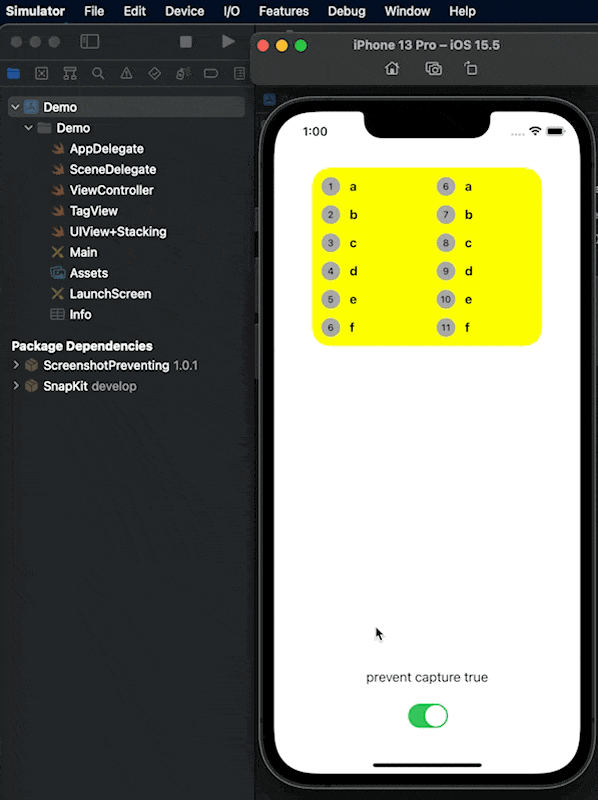

# ScreenshotPreventing

A simple wrapper view that is able to prevent screenshot or screen recording on iOS.

## Requirement

- iOS 12+

## Installation

### Swift Package Manager

[Swift Package Manager](https://swift.org/package-manager/) is a tool for managing the distribution of Swift code. It’s integrated with the Swift build system to automate the process of downloading, compiling, and linking dependencies.

> Xcode 11+ is required to build ScreenshotPreventing using Swift Package Manager.

To integrate ScreenshotPreventing into your Xcode project using Swift Package Manager, add it to the dependencies value of your `Package.swift`:

```swift
dependencies: [
    .package(url: "https://github.com/yoxisem544/ScreenshotPreventing.git", .upToNextMajor(from: "1.1.0"))
]
```

### CocoaPods

For ScreenshotPreventing, use the following entry in your Podfile:

```ruby
pod 'ScreenshotPreventing', '~> 1.1.0'
# or 
pod 'ScreenshotPreventing/RxSwift', '~> 1.1.0'
```

## Demo Project

Clone this project, then

```shell
cd ScreenshotPreventing
open Demo/Demo.xcodeproj
```

Then build for any iOS simulator to test this out.

By triggering screenshot on simulator, look for `Simulator > Device > Trigger Screenshot`.



## Example

You can wrap view you don't want to be screenshot inside `ScreenshotPreventingView`

```swift
import UIKit
import ScreenshotPreventing

class ViewController: UIViewController {

    let stack = UIStackView()
    let container = ScreenshotPreventingView(contentView: stack)

    override func viewDidLoad() {
        super.viewDidLoad()

        // add to subview here.
    }
}
```

Or you can setup content view later.

```swift
import UIKit
import ScreenshotPreventing

class ViewController: UIViewController {

    let stack = UIStackView()
    let container = ScreenshotPreventingView()

    override func viewDidLoad() {
        super.viewDidLoad()

        // add to subview here.
        container.setup(contentView: stack)
    }
}
```

## RxSwift Extension

If you use RxSwift in your project, there is a Rx extension to drive `preventScreenCapture` property on `ScreenshotPreventingView`.

Use `RxScreenshotPreventing` pacakge for this extension.

```swift
whetherOrNotToPreventScreenshotObservable
    .bind(to: screenshotPreventingView.rx.preventScreenCapture)
    .disposed(by: bag)
```